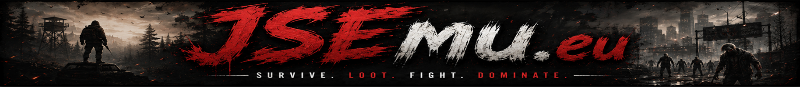

# JSEmu.eu Launcher

The JSEmu.eu Launcher is an application designed to make playing Just Survive community servers simple and accessible, without requiring any technical knowledge.

The launcher allows players to easily install and update the correct version of Just Survive, connect to JSEmu.eu servers, manage required game files and patches, and stay informed about the latest project updates.

## Features

- Easy installation and automatic game updates
- Access to official JSEmu.eu servers
- Support for connecting to custom servers
- Automatic patch and required file management
- Game directory configuration
- Server selection directly from the launcher
- Latest JSEmu.eu news and announcements
- Quick access to support and bug-reporting pages
- Simple and user-friendly interface

## JSEmu.eu Launcher Tutorial

1. Download the latest launcher installer from the **Releases** section.

2. Run the installer and accept the Windows UAC prompt if it appears.

3. Open the launcher and select the directory containing your Just Survive game files using the directory selection button.

4. Allow the launcher to check, download, and update all required game files.

5. Select a JSEmu.eu server from the server list.

6. Enter your Account Key in the launcher settings if the selected server requires one.

7. Click the **Play** button to launch the game and connect to the selected server.

## Connecting to a Custom Server

To connect to a custom server:

1. Open the server selection menu.
2. Select **New Server...**
3. Enter the server IP address.
4. Enter a name for the server.
5. Save the server and select it from the list.
6. Click **Play**.

## Account Key

An Account Key may be required to connect to official JSEmu.eu servers.

You can create an account and manage your Account Key at:

[JSEmu.eu](https://jsemu.eu)

Account Keys are not necessarily required for custom community servers.

## Installation

Download the newest version of the launcher from the GitHub **Releases** page.

Available files may include:

- `JSEmu-Launcher-Setup.exe`
- `JSEmu-Launcher.exe`
- `JSEmu-Launcher.msi`

It is recommended to use the installer version.

## Windows Security Warning

Because JSEmu.eu Launcher is an independently distributed application, Windows SmartScreen may display an **Unknown Publisher** or **Windows protected your PC** warning.

To continue:

1. Click **More info**.
2. Verify that the file was downloaded from the official JSEmu.eu GitHub repository.
3. Click **Run anyway**.

Always download the launcher only from official JSEmu.eu sources.

## Support

For help with installation, game files, launcher errors, Account Keys, or connecting to a server, visit:

- Website: [https://jsemu.eu](https://jsemu.eu)
- GitHub Issues: use the **Issues** section of this repository
- Discord: available through the official JSEmu.eu website

When reporting a problem, include:

- A description of the issue
- A screenshot of the error
- Launcher logs, if available
- Your Windows version
- The name of the selected server

## Bug Reports

Launcher bugs and technical problems can be reported through the GitHub **Issues** section.

Before submitting a new issue, check whether the same problem has already been reported.

Do not publicly include:

- Account Keys
- Passwords
- Authentication tokens
- Private server credentials
- Personal information

## Credits

- Based on the original H1Emu Launcher created by [Noctiamor](https://github.com/Noctiamor) and [Relish](https://github.com/aarongarnerm).
- Original launcher concept art by LegendsNeveerrDie.
- Original H1Emu logos created by ZamZam.
- Modified and adapted for JSEmu.eu by the JSEmu.eu development team.

## Related Project

### h1z1-server

The server emulator used by Just Survive community projects is available through the `h1z1-server` package.

## Disclaimer

JSEmu.eu is a community project and is not affiliated with, endorsed by, or sponsored by Daybreak Game Company.

All trademarks and game assets belong to their respective owners.